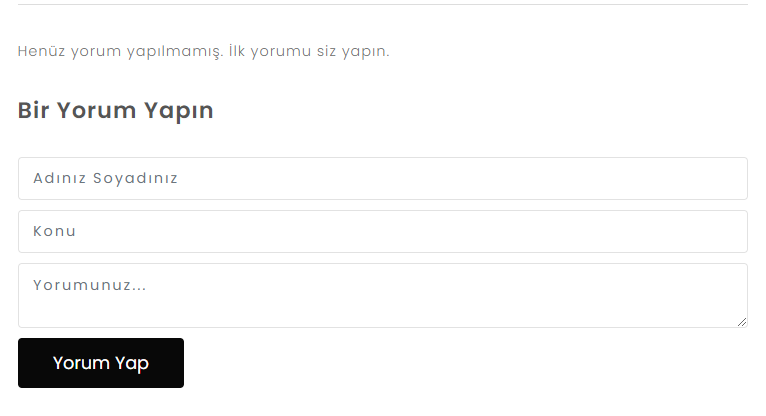

# ASP.Net Core 5.0 Proje Kampı
## Ödev 1
- Blog yazısına hiç yorum yapılmamışsa, "ilk yorumu siz yapın" yazısı eklendi.

## Ödev 2
- Kayıt olurken parolanın iki kez girilmesi sağlandı.
- Fluent Validation kullanılarak, kullanıcının parolasında en az bir büyük harf, en az bir küçük harf ve en az bir sayı şartı sağlandı.
- Kayıt olma sayfasında değerleri View Modelde tutulan şehir seçimi sağlandı.

## Ödev 3
- Yorum ve mail bülteni ekleme sorunu düzeltildi.

## Ödev 4
- Github güncellendi.

